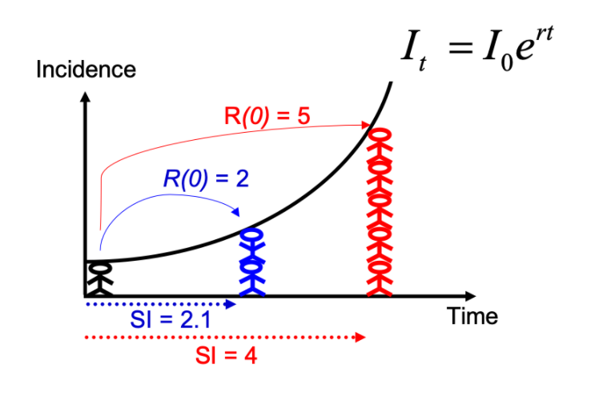

# Introducción

Esta práctica simula la evaluación temprana y la reconstrucción de un brote de enfermedad por el virus del Ébola (EVE). Introduce varios aspectos del análisis de la etapa inicial de un brote, incluida la tasa de letalidad (CFR por sus siglas en inglés de Case Fatality Ratio), curvas epidemiológicas, estimación de la tasa de crecimiento, datos del rastreo de contactos, retrasos y estimaciones de transmisibilidad.

***
***

# Un nuevo brote de EVE en un país ficticio de África occidental

Se ha notificado un nuevo brote de EVE en un país ficticio de África occidental. El Ministerio de Salud se encarga de coordinar la respuesta al brote, y lo ha contratado como consultor en análisis epidémico para informar la respuesta en tiempo real.

***
***

# Instalar paquetes necesarios

```{r echo=TRUE, message=FALSE, warning=FALSE,comment=""}
library(readxl)
library(incidence)
library(epicontacts)
library(distcrete)
library(epitrix)
library(EpiEstim)
library(projections)
library(ggplot2)
library(magrittr)
library(binom)
library(ape)
library(outbreaker2)
library(here)
library(tidyverse)
library(knitr)
```

***
***

# Cargar bases de datos

***

```{r echo=TRUE, message=FALSE, warning=FALSE,comment=""}
linelist <- read_excel("data/linelist_20140701.xlsx", na = c("", "NA"))

contacts <- read_excel("data/contacts_20140701.xlsx", na = c("", "NA"))
```

***

Tómese su tiempo para mirar los datos y la estructura aquí.

+ **¿Son los datos y el formato similares a bases de datos de casos que ha visto en el pasado?**

**Respuesta:** Sí

+ Si fuera parte del equipo de investigación de un brote, **¿qué otra información le gustaría recopilar?**

**Respuesta:** 

- Edad
- Comorbilidades
- Reinfecciones 
- Ubicación geográfica: Zona, barrio, identificador del hogar

***

```{r echo=TRUE, message=FALSE, warning=FALSE,comment=""}
head(linelist)
```

***
# Cambio de formato a Date

***

```{r echo=TRUE, message=FALSE, warning=FALSE,comment=""}
linelist$date_of_infection <- as.Date(linelist$date_of_infection, format = "%Y-%m-%d")
linelist$date_of_onset <- as.Date(linelist$date_of_onset, format = "%Y-%m-%d")
linelist$date_of_hospitalisation <- as.Date(linelist$date_of_hospitalisation, format = "%Y-%m-%d")
linelist$date_of_outcome <- as.Date(linelist$date_of_outcome, format = "%Y-%m-%d")
linelist$outcome <- as.factor(linelist$outcome)
linelist$gender <- as.factor(linelist$gender)
linelist$hospital <- as.factor(linelist$hospital)
```
***
***

# Limpieza de datos y análisis descriptivo

Mire más de cerca los datos contenidos en este `linelist`.

+ **¿Qué observa?**

**Respuesta:** La base de datos linelist tiene 169 observaciones por 11 variables, las cuales son de tipo: númerico, fecha y caracter.

***

```{r echo=TRUE, message=FALSE, warning=FALSE,comment=""}
head(linelist)

```

***

Puede notar que faltan entradas. Un paso importante en el análisis es identificar cualquier error en la entrada de datos. Aunque puede ser difícil evaluar los errores en los nombres de los hospitales, *es de esperar que la fecha de la infección sea siempre anterior a la fecha de aparición de los síntomas*.

Limpie este conjunto de datos para eliminar cualquier entrada con períodos de incubación negativo o de 0 días.

***

```{r message=FALSE, warning=FALSE, comment="", include=FALSE}
mistakes <- which(linelist$date_of_onset <= linelist$date_of_infection)
linelist[mistakes, ]

## Alternativa con la librería dplyr
#linelist %>% group_by(case_id) %>% 
#  filter(date_of_onset - date_of_infection<1)
```

***

Guarde su base de datos de casos “limpia” como un objeto nuevo: `linelist_clean`

```{r echo=TRUE, message=FALSE, warning=FALSE,comment=""}
linelist_clean <- linelist[-mistakes, ]
```

***
***

# Calculemos la probabilidad de muerte en los casos (CFR)

Aquí está el número de casos por estado de resultado. **¿Cómo calcularía el CFR a partir de esto?**

**Respuesta:** La Case Fatality Rate (CFR) sería el cociente entre el numero de muertes sobre el total de infectados. Nota: se excluyen los NA.


```{r echo=TRUE, message=FALSE, warning=FALSE,comment=""}
table(linelist_clean$outcome, useNA = "ifany")
```

***

Piense en qué hacer con los casos cuyo resultado es NA.

**Respuesta:** Respecto a los NA se deben excluir de el calculo de la CFR puesto que se puede subestimar o sobreestimar el indicador. Es importante hacer un calculo del indicador en diferentes momentos del brote, cuando  se conozca el desenlace de cada uno de los pacientes.

***

Calculando la probabilidad de muerte en los casos:

```{r echo=TRUE, message=FALSE, warning=FALSE,comment=""}
n_dead <- sum(linelist_clean$outcome %in% "Death")
n_known_outcome <- sum(linelist_clean$outcome %in% c("Death", "Recover"))
n_all <- nrow(linelist_clean)
cfr <- n_dead / n_known_outcome
cfr_wrong <- n_dead / n_all
cfr_with_CI <- binom.confint(n_dead, n_known_outcome, method = "exact")
kable(cfr_with_CI, caption = "cfr_with_CI")
cfr_wrong_with_CI <- binom.confint(n_dead, n_all, method = "exact");
kable(cfr_wrong_with_CI, caption = "cfr_wrong_with_CI")
```

***
***

# Miremos las curvas de incidencia

La primera pregunta que queremos saber es simplemente: *¿qué tan mal está?* El primer paso del análisis es descriptivo: queremos dibujar una epicurva o curva epidemiológica. Esto permite visualizar la incidencia a lo largo del tiempo por fecha de inicio de los síntomas.


***

```{r echo=TRUE, message=FALSE, warning=FALSE,comment=""}
i_daily <- incidence(linelist_clean$date_of_onset)
i_daily
```

```{r echo=TRUE, message=FALSE, warning=FALSE,comment=""}
plot(i_daily, border = "black")
```

***

**Respuesta:**  El caso índice se reportó para el 07 de abril de 2014, con una duración del brote de 4 meses aproximadamente. El tipo de fuente de este brote es de fuente propagada.


```{r echo=TRUE, message=FALSE, warning=FALSE,comment=""}
i_daily <- incidence(linelist_clean$date_of_onset, 
                     last_date = as.Date(max(linelist_clean$date_of_hospitalisation,
                                              na.rm = TRUE)))
i_daily
```

***

Otro problema es que puede ser difícil interpretar las tendencias al observar la incidencia diaria, por lo que también calcule y grafique la incidencia semanal `i_weekly`, como se ve a continuación:

```{r echo=TRUE, message=FALSE, warning=FALSE,comment=""}
i_weekly <- incidence(linelist_clean$date_of_onset, interval = 7, 
                      last_date = as.Date(max(linelist_clean$date_of_hospitalisation, na.rm = TRUE)))

i_weekly

plot(i_weekly, border = "black")
```

***
***

# Estimación de la tasa de crecimiento mediante un modelo log-lineal

El modelo de incidencia más simple es probablemente el modelo log-lineal, es decir, un modelo de regresión lineal sobre incidencias transformadas logarítmicamente. Para ello trabajaremos con incidencia semanal, para evitar tener demasiados problemas con incidencia cero (que no se pueden registrar).

Grafique la incidencia transformada logarítmicamente:

***

```{r echo=TRUE, message=FALSE, warning=FALSE,comment=""}
ggplot(as.data.frame(i_weekly)) + 
  geom_point(aes(x = dates, y = log(counts))) + 
  scale_x_incidence(i_weekly) +
  xlab("date") +
  ylab("log weekly incidence") + 
  theme_minimal()
```

***

**¿Qué le dice esta gráfica sobre la epidemia?**

**Respuesta:** Se observa un incremento exponencial de casos semanales hasta la semana 23 (mediados de junio).

***

Ajuste un modelo log-lineal a los datos de incidencia semanal:

***

```{r echo=TRUE, message=FALSE, warning=FALSE,comment=""}
f <- incidence::fit(i_weekly)
f

plot(i_weekly, fit = f)
```

***

Mirando la gráfica y el ajuste, **¿cree que este es un ajuste razonable?**

**Respuesta:** Lo observado se ajusta a un crecimiento exponencial, sin embargo, no es un ajuste razonable debido a que se continuan incluyendo las últimas semanas, las cuales, presentan datos atípicos que pueden sesgar la gráfica.

***
***

### Encontrando una fecha límite adecuada para el modelo log-lineal, en función de los retrasos observados

Utilizando la gráfica del logaritmo (incidencia) que graficó anteriormente, y pensando en por qué el crecimiento exponencial no puede observarse en las últimas semanas, elija una fecha límite y ajuste el modelo logarítmico lineal a una sección adecuada de la epicurva donde crea que puede estimar de manera más confiable la tasa de crecimiento r, y el tiempo de duplicación.

Es posible que desee examinar cuánto tiempo después de la aparición de los síntomas los casos son hospitalizados; para obtener un reporte de una fecha especifica, siga estos comandos:

***

```{r echo=TRUE, message=FALSE, warning=FALSE,comment=""}
summary(as.numeric(linelist_clean$date_of_hospitalisation - linelist_clean$date_of_onset))
```

***

**¿cuántas semanas debe descartar al final de la epicurva?**

**Respuesta:** Las semanas que no estuvieran completas de notificación. Usualmente las notificaciones reportadas pueden llegar a tener un retraso en la notificación. 

***

```{r echo=TRUE, message=FALSE, warning=FALSE,comment=""}
# Semanas a descartar al final de la epicurva
n_weeks_to_discard <- 2

min_date <- min(i_daily$dates)
max_date <- max(i_daily$dates) - n_weeks_to_discard * 7

# Para truncar la incidencia semanal 
i_weekly_trunc <- subset(i_weekly, 
                         from = min_date, 
                         to = max_date) # descarte las últimas semanas de datos
# incidencia diaria truncada.No la usamos para la regresión lineal pero se puede usar más adelante
i_daily_trunc <- subset(i_daily, 
                         from = min_date, 
                         to = max_date) # eliminamos las últimas dos semanas de datos
```

***

Vuelva a montar y a graficar el modelo logarítmico lineal, pero utilizando los datos truncados `i_weekly_trunc`. Los resultados deben ser como los siquientes:

***

```{r echo=TRUE, message=FALSE, warning=FALSE,comment=""}
f <- incidence::fit(i_weekly_trunc)
f
plot(i_weekly_trunc, fit = f)
```

***

Observe las estadísticas resumidas de su ajuste:

***

```{r echo=TRUE, message=FALSE, warning=FALSE,comment=""}
summary(f$model)
```

***

Puede observar la bondad del ajuste (Rsquared), la pendiente estimada (tasa de crecimiento/growth rate) y el tiempo de duplicación correspondiente como se muestra a continuación:

***

**¿El modelo se ajusta bien a los datos?**

**Respuesta:** El R ajustado de 0.8 nos permite determinar que el modelo se ajusta bien a los datos.

```{r echo=TRUE, message=FALSE, warning=FALSE,comment=""}
adjRsq_model_fit <- summary(f$model)$adj.r.squared
```

***

**¿ Cuál es la tasa de crecimiento estimada de la epidemia?**

**Nota:** Incremento promedio del log de casos nuevos o incidentes log(y) por unidad de tiempo. Estimado en un modelo log-lineal de incidencia.

**Respuesta** 0.05

```{r echo=TRUE, message=FALSE, warning=FALSE,comment=""}
daily_growth_rate <- f$model$coefficients['dates.x']
# intervalo de confianza:
daily_growth_rate_CI <- confint(f$model, 'dates.x', level=0.95)
```

***

**¿Cuál es el tiempo de duplicación de la epidemia?**


**Nota:** Tiempo que le toma a la curva epidémica de la enfermedad en vigilancia para duplicar el número de casos incidentes, según su tasa de crecimiento.

**Respuesta** 14.52 días IC95%(10.8-22.06)

```{r echo=TRUE, message=FALSE, warning=FALSE,comment=""}
doubling_time_days <- log(2) / daily_growth_rate
# intervalo de confianza:
doubling_time_days_CI <- log(2) / rev(daily_growth_rate_CI)
```

***

> Aunque el log-lineal es un método simple y rápido para la evaluación temprana de una epidemia, se debe tener cuidado de ajustar solo hasta el punto en que haya un crecimiento epidémico. Tenga en cuenta que puede resultar difícil definir este punto.

***
***

# Estimación de la transmisibilidad $(R)$

### Seguimiento de contactos

El rastreo de contactos es uno de los pilares de la respuesta a un brote de ébola. Esto implica identificar y hacer un seguimiento de las personas en riesgo que hayan tenido contacto con un caso conocido, es decir, que puedan haber sido infectadas. Para el ébola, los contactos se vigilan durante 21 días (el límite superior del período de incubación). Esto asegura que los contactos que se vuelven sintomáticos puedan aislarse rápidamente, reduciendo la posibilidad de una mayor transmisión. Para esto usamos la base de datos de casos completa en lugar de `linelist_clean` donde descartamos las entradas con errores en las fechas, porque apesar del error el contacto aún puede ser válido.

Usando la función `make_epicontacts` en el paquete `epicontacts`, cree un nuevo objeto `epicontacts` llamado `epi_contacts` . Asegúrese de comprobar los nombres de las columnas de los argumentos relevantes **“to”** y **“from”**.

***

```{r echo=TRUE, message=FALSE, warning=FALSE,comment=""}
epi_contacts <- make_epicontacts(linelist, 
                                 contacts, 
                                 id = "case_id",
                                 from = "infector",
                                 to = "case_id")

epi_contacts
```

***

### Modelo de proceso de ramificación

La transmisibilidad de la enfermedad puede evaluarse mediante la estimación del número de reproducción $R$, definido como el número esperado de casos secundarios por caso infectado. En las primeras etapas de un brote, y asumiendo una gran población sin inmunidad, esta cantidad es también el número de reproducción básico  $R_0$, es decir, $R$ en una gran población totalmente susceptible.

El paquete `EpiEstim` implementa una estimación bayesiana de $R$, utilizando las fechas de inicio de los síntomas y la información sobre la distribución del intervalo serial, es decir, la distribución del tiempo desde el inicio de los síntomas en un caso y el inicio de los síntomas en quien lo infecto (infectante) (ver Cori et al., 2013, AJE 178: 1505-1512).

En resumen, `EpiEstim` usa un modelo simple que describe la incidencia en un día dado como la distribución de Poisson, con una media determinada por la fuerza total de infección en ese día:

$$I_{t} \sim Poisson(\lambda_{t})$$

donde $I_{t}$ es la incidencia (basada en la aparición de los síntomas), $t$ es el día y $\lambda_{t}$ es la fuerza de la infección ese día. Teniendo en cuenta $R$ el número de reproducción y $w()$ la distribución de intervalo serial discreta, tenemos: 

$$\lambda_{t} = R \sum_{s=1}^{t} I_{s}w (t-s)$$

La verosimilitud (probabilidad de observar los datos dados el modelo y los parámetros) se define como una función de $R$:

$$L(I) = p(I|R) = \prod_{t=1}^{T} f_{P}(I_{t},\lambda_{t})$$

donde $f_{P}(.,\mu)$ es la función de masa de probabilidad de una distribución de Poisson con media $\mu$.

***

### Estimación del intervalo serial (SI)

Dado que los datos se recopilaron sobre pares de individuos infectantes e infectados, esto debería ser suficiente para estimar la distribución del intervalo en serie. Si ese no fuera el caso, podríamos haber utilizado datos de brotes pasados en su lugar.

Utilice la función `get_pairwise` para extraer el intervalo de la serie, es decir, la diferencia en la fecha de aparición entre los individuos infectantes e infectados:

***

```{r echo=TRUE, message=FALSE, warning=FALSE,comment=""}
si_obs <- get_pairwise(epi_contacts, "date_of_onset")
summary(si_obs)
```


```{r echo=TRUE, message=FALSE, warning=FALSE,comment=""}
hist(si_obs, breaks = 0:30,
     xlab = "Días después de la aparición de los síntomas", ylab = "Frecuencia",
     main = "intervalo serial (distribución empírica)",
     col = "grey", border = "white")
```

***

**¿Qué opina de esta distribución?** Realice cualquier ajuste que considere necesario y luego use la función `fit_disc_gamma` del paquete `epitrix` para ajustar estos datos a una distribución Gamma de valores discretos. Sus resultados deberían verse aproximadamente como:

```{r echo=TRUE, message=FALSE, warning=FALSE,comment=""}
si_fit <- fit_disc_gamma(si_obs, w = 1)
si_fit
```

***

`si_fit` contiene información diversa sobre los retrasos ajustados, incluida la distribución estimada en la ranura `$distribution`. Puede comparar esta distribución con los datos empíricos en la siguiente gráfica:

***

```{r echo=TRUE, message=FALSE, warning=FALSE,comment=""}
si <- si_fit$distribution
si
```

```{r echo=TRUE, message=FALSE, warning=FALSE,comment=""}
## compare fitted distribution
hist(si_obs, xlab = "Días después de la aparición de los síntomas", ylab = "Frecuencia",
     main = "intervalo serial: ajustar a los datos", col = "salmon", border = "white",
     50, ylim = c(0, 0.15), freq = FALSE, breaks = 0:35)
points(0:60, si$d(0:60), col = "#9933ff", pch = 20)
points(0:60, si$d(0:60), col = "#9933ff", type = "l", lty = 2)
```

***

**¿Confiaría en esta estimación del tiempo de generación?** **¿Cómo lo compararía con las estimaciones reales del brote de EVE en África occidental (Equipo de respuesta al ébola de la OMS (2014) NEJM 371: 1481–1495) con una media de 15,3 días y una desviación estándar de 9,3 días?**

**Respuesta:** La media de días estimado del tiempo de generación observado se encontró en alrededor de 8 días con una desviación estándar de 6 días, mucho menor al reportado por NEJM. La explicación de esta diferencia puede ser porque los tiempos de IS mas largos no se hayan reportado, o porque se cuenta con estimación bajo un set de datos reducido. 


***

### Estimación del número de reproducción

Ahora que tenemos estimaciones del intervalo de la serie, podemos usar esta información para estimar la transmisibilidad de la enfermedad (medida por $R_{0}$). Asegúrese de utilizar el objeto de incidencia diaria (no semanal) truncado al período en el que ha decidido que hay un crecimiento exponencial (`i_daily_trunc`).

Utilizando las estimaciones de la media y la desviación estándar del intervalo serial que acaba de obtener, utilice la función `estimate_R` para estimar el número de reproducción (consulte `?estimate_R`) y almacene el resultado en un nuevo objeto `R`.

Antes de usar `estimate_R`, necesita crear un objeto `config` usando la función `make_config`, donde usted debe especificar la ventana de tiempo en la cual desea estimar el número de reproducción, así como el `mean_si` y `std_si` a usar. Para la ventana de tiempo, use `t_start = 2` (solo puede estimar R apartir del día 2 en adelante, dado que está condicionando la incidencia observada en el pasado) y especifique `t_end = length (i_daily_trunc$counts)` para estimar R hasta la último fecha de su incidencia truncada `i_daily_trunc` .

***

```{r echo=TRUE, message=FALSE, warning=FALSE,comment=""}
config <- make_config(mean_si = si_fit$mu, # media de la distribución si estimada anteriormente
                      std_si = si_fit$sd,  # desviación estándar de la distribución si estimada anteriormente
                      t_start = 2,         # día de inicio de la ventana de tiempo
                      t_end = length(i_daily_trunc$counts)) # último día de la ventana de tiempo
```

***

Use `estimate_R` usando el `método = "parametric_si"`. 

***

```{r echo=TRUE, message=FALSE, warning=FALSE,comment=""}
R <- estimate_R(incid = i_daily_trunc,
  method = c("parametric_si"),
  si_data = NULL,
  si_sample = NULL,
  config = config)
```

***

Los datos ahora deberían verse así:

```{r echo=TRUE, message=FALSE, warning=FALSE,comment=""}
plot(R, legend = FALSE) 
```

***

Extraiga la mediana y los intervalos de credibilidad del $95\%$ ($95\%$ CrI) para el número de reproducción de la siguiente manera:

```{r echo=TRUE, message=FALSE, warning=FALSE,comment=""}
R_median <- R$R$`Median(R)`
R_median
R_CrI <- c(R$R$`Quantile.0.025(R)`, R$R$`Quantile.0.975(R)`)
R_CrI
```

***

Interprete estos resultados: **¿qué opina del número de reproducción?** **¿Qué refleja?** Con base en la última parte de la epicurva, algunos colegas sugieren que la incidencia está disminuyendo y que el brote puede estar bajo control. **¿Qué opina de esto?**

**Respuesta:** El número de reproducción básico se obuvo en 1.2, sin embargo, este dato difiere de las estimaciones definidas en otros contextos, las cuales se encuentran entre 2 y 3, por lo tanto en este caso, este número de reproducción no daría cuenta realmente de la existencia de un brote de la magnitud que se observó. Es posible que al tener IS inadecuado conlleve a estimaciones del R0 incorrectas. 

Por otra parte, asegurar la disminución y control de los casos con sólo los datos de 2 semanas, no sería confiable. Además, como anteriormente se menciono, en estas últimas semanas puede haber un subregistro. 

***
***

Tenga en cuenta que podría haber estimado R0 directamente a partir de la tasa de crecimiento y el intervalo serial, utilizando la fórmula descrita en Wallinga y Lipsitch, Proc Biol Sci, 2007:

$$R_{o} \frac{1}{\int_{s=0}^{+\infty} e^{-rs}w(s)ds}$$

e implementando la función `r2R0` del paquete `epitrix`. Aunque esto puede parecer una fórmula complicada, el razonamiento detrás de ella es simple y se ilustra en la figura siguiente: para una curva de incidencia observada que crece exponencialmente, si conoce el intervalo serial, puede derivar el número de reproducción.


```{r echo=FALSE, fig.height=5, fig.width=5, message=FALSE, warning=FALSE, comment=""}

```

En comparación con la figura anterior, hay incertidumbre en la tasa de crecimiento r, y el intervalo serial tiene una distribución completa en lugar de un valor único. Esto se puede tener en cuenta al estimar R de la siguiente manera:

```{r echo=TRUE, message=FALSE, warning=FALSE,comment=""}
# genere una muestra de estimaciones de R0 a partir de la tasa de crecimiento y el intervalo serial que estimamos anteriormente 
R_sample_from_growth_rate <- lm2R0_sample(f$model, # modelo log-lineal que contiene nuestras estimaciones de                                                    # la tasa de crecimiento r
                                          si$d(1:100), # distribución de intervalo serial (truncado
                                                       #después de 100 días)
                                          n = 1000) # tamaño de muestra deseado 

# Grafique esto:
hist(R_sample_from_growth_rate)
```

***

**¿Cuál es la mediana?**

**Respuesta:** 1.41

```{r echo=TRUE, message=FALSE, warning=FALSE,comment=""}
R_median_from_growth_rate <- median(R_sample_from_growth_rate)
R_median_from_growth_rate # compare with R_median
```

**¿ Cuál es el IC del 95%?**

**Respuesta:** IC95% (1.26-1.57)

```{r echo=TRUE, message=FALSE, warning=FALSE,comment=""}
R_CI_from_growth_rate <- quantile(R_sample_from_growth_rate, c(0.025, 0.975))
R_CI_from_growth_rate # compare con R_CrI
```

***

Tenga en cuenta que las estimaciones anteriores son ligeramente diferentes de las obtenidas utilizando el modelo de proceso de ramificación. Hay algunas razones para esto. En primer lugar, usted utilizó datos más detallados (incidencia diaria frente a incidencia semanal) para la estimación del proceso de ramificación (EpiEstim). Además, el modelo log-lineal pone el mismo peso en todos los puntos de datos, mientras que el modelo de proceso de ramificación pone un peso diferente en cada punto de datos (dependiendo de la incidencia observada en cada paso de tiempo). Esto puede llevar a estimaciones de R ligeramente diferentes.

***
***


# Estimación de la transmisibilidad variable en el tiempo

Cuando la suposición de que ($R$) es constante en el tiempo se vuelve insostenible, una alternativa es estimar la transmisibilidad variable en el tiempo utilizando el número de reproducción instantánea ($R_t$). Este enfoque, introducido por Cori et al. (2013), también se implementa en el paquete `EpiEstim.` Estima ($R_t$) para ventanas de tiempo personalizadas (el valor predeterminado es una sucesión de ventanas de tiempo deslizantes), utilizando la misma probabilidad de Poisson descrita anteriormente. A continuación, estimamos la transmisibilidad para ventanas de tiempo deslizantes de 1 semana (el valor predeterminado de `estimate_R`):

***

```{r echo=TRUE, message=FALSE, warning=FALSE,comment=""}
config = make_config(list(mean_si = si_fit$mu, std_si = si_fit$sd))  
# t_start y t_end se configuran automáticamente para estimar R en ventanas deslizantes para 1 semana de forma predeterminada.
```

```{r echo=TRUE, message=FALSE, warning=FALSE,comment=""}
# use estimate_R using method = "parametric_si"
Rt <- estimate_R(i_daily_trunc, method = "parametric_si", 
                           si_data = si_data,
                           config = config)
```

```{r echo=TRUE, message=FALSE, warning=FALSE,comment=""}
# mire las estimaciones de Rt más recientes:
tail(Rt$R[, c("t_start", "t_end", "Median(R)", 
             "Quantile.0.025(R)", "Quantile.0.975(R)")])
```

***

Grafique la estimación de $R$ sobre le tiempo:

```{r echo=TRUE, message=FALSE, warning=FALSE,comment=""}
plot(Rt, legend = FALSE)
```

***

**Interprete estos resultados: ¿qué opina del número de reproducción? ¿Qué refleja? 

**¿Cómo interpretaría este resultado? ¿Cuál es la salvedad de esta representación?**

**Respuesta:** El Rt nos permite observar que aunque se encontró en aumento 2.5 en las primeras semanas, aproximadamente, en mayo, el Rt empezó a disminuir, alcanzando un Rt cercano a 1, lo que puede estar dando cuenta de un control "adecuado" del brote.

***
***

**¿Qué habría concluido si en lugar de usar `i_daily_trunc` como se indicó anteriormente, hubiera usado toda la curva de epidemias, es decir, `i_daily`?**

**Respuesta:** Es posible que nos hubiera dado una estimación imprecisa, generando una falsa idea de un control adecuado, que tal vez llevara al Rt por debajo de uno, cuando realmente no era así.

```{r echo=TRUE, message=FALSE, warning=FALSE,comment=""}
# use estimate_R usando method = "parametric_si", la misma configuración que la anterior pero i_daily en lugar de i_daily_trunc
Rt_whole_incid <- estimate_R(i_daily, method = "parametric_si", 
                           si_data = si_data,
                           config = config)
```

```{r echo=TRUE, message=FALSE, warning=FALSE,comment=""}
# mire las estimaciones de Rt más recientes:
tail(Rt_whole_incid$R[, c("t_start", "t_end", 
                         "Median(R)", "Quantile.0.025(R)", "Quantile.0.975(R)")])
```

***

### Guardar datos y salidas


```{r echo=TRUE, message=FALSE, warning=FALSE,comment=""}
saveRDS(linelist, "data/clean/linelist.rds")
saveRDS(linelist_clean, "data/clean/linelist_clean.rds")
saveRDS(epi_contacts, "data/clean/epi_contacts.rds")
saveRDS(si, "data/clean/si.rds")
```

***

### Sobre este documento

Este documento ha sido una adaptación de los materiales disponibles en [RECON Learn](https://www.reconlearn.org/) para ser utilizados en la asignatura Epidemiología de enfermedades infecciosas. 


